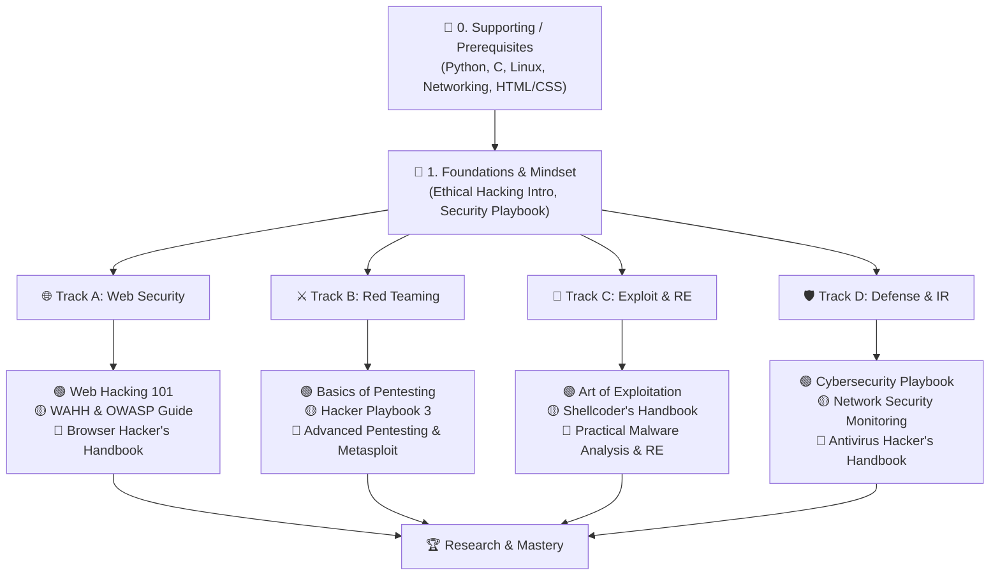

# 🛡️ Awesome Cybersecurity Books

  <em>A curated, structured shelf of 70+ cybersecurity, hacking, and supporting fundamentals organized by domain and difficulty—no paywall required.</em>

  
  
  
  
  

---

### 📂 Direct Drive Library Access

👉 **[Access Full Google Drive Library Folder](https://drive.google.com/drive/folders/1eocSz3hnalhkdJ_LfNKuXWADwRp_M23L?usp=sharing)**

📍 **Pair this library with our hands-on [Penetration Testing Roadmap](https://github.com/SagarBiswas-MultiHAT/penetration-testing-roadmap)** (500+ free labs, OWASP Top 10, weekly curriculum).

💬 **Join the Discussion:** [🛡️ Welcome to awesome-cybersecurity-books Discussions!](https://github.com/SagarBiswas-MultiHAT/awesome-cybersecurity-books/discussions/3) || [💡 Book Suggestions & Missing Gems](https://github.com/SagarBiswas-MultiHAT/awesome-cybersecurity-books/discussions/5)

---

## ⚡ Why This Library?

Unlike flat "awesome lists" that dump hundreds of unsorted links, this repository provides a **guided, battle-tested curriculum**:

- 📊 **Ordered by Difficulty**: Within every domain, books progress strictly from **🟢 Beginner → 🟡 Intermediate → 🔴 Advanced**.
- 🗺️ **Structured Learning Roadmap**: Clear progression paths depending on your career goals (Red Team, Blue Team, Reverse Engineering, Web Security).
- 🔓 **100% Free Self-Study**: Designed so anyone can start from scratch without hitting a paywall.
- 🤝 **Community Maintained**: Living list continuously updated by security researchers and practitioners.

---

## 🗺️ Visual Learning Path

---

## 📌 Legend & Difficulty Tags
- 🟢 **Beginner**: Accessible entry point. Requires minimal prior security background.
- 🟡 **Intermediate**: Requires solid networking, operating systems, or programming literacy.
- 🔴 **Advanced**: Low-level internals, assembly, kernel manipulation, and complex vulnerability engineering.

---

## 📋 Table of Contents

0. [Supporting / Prerequisite Resources (11 Books)](#0-supporting--prerequisite-resources-11-books)
1. [Foundations / General Cybersecurity & Mindset (5 Books)](#1-foundations--general-cybersecurity--mindset-5-books)
2. [Penetration Testing / Red Team Methodology (5 Books)](#2-penetration-testing--red-team-methodology-5-books)
3. [Web Application Security & Bug Bounties (10 Books)](#3-web-application-security--bug-bounties-10-books)
4. [Network Security & Monitoring (4 Books)](#4-network-security--monitoring-4-books)
5. [Exploit Development & Binary / Memory Vulnerabilities (8 Books)](#5-exploit-development--binary--memory-vulnerabilities-8-books)
6. [Reverse Engineering & Malware Analysis (6 Books)](#6-reverse-engineering--malware-analysis-6-books)
7. [Mobile Application Security (4 Books)](#7-mobile-application-security-4-books)
8. [Cryptography (2 Books)](#8-cryptography-2-books)
9. [Defensive Security / Incident Response (3 Books)](#9-defensive-security--incident-response-3-books)
10. [Programming & Secure Coding (6 Books)](#10-programming--secure-coding-6-books)
11. [Scripting, Tooling & Automation (7 Books)](#11-scripting-tooling--automation-7-books)
12. [Browser & Client-Side Security (4 Books)](#12-browser--client-side-security-4-books)
13. [Social Engineering & Human Factors (2 Books)](#13-social-engineering--human-factors-2-books)
14. [Specialized / Miscellaneous Extras (5 Books)](#14-specialized--miscellaneous-extras-5-books)
15. [Suggested Learning Path](#15-suggested-learning-path)
16. [Contributing](#contributing)

---

## 0. Supporting / Prerequisite Resources (11 Books)

> 📖 **Detailed Track Guide**: [docs/prerequisites.md](docs/prerequisites.md)

Tackle these first if any fundamental category feels unfamiliar; they shorten the time required to appreciate the security-focused titles.

### Programming Fundamentals
- 🟢 **Python Crash Course** by Eric Matthes — Approachable way to build the scripting foundation you will reuse everywhere.
- 🟢 **Python Notes for Professionals** (GoalKicker) — Quick-reference companion while practicing Python.
- 🟡 **The C Programming Language (2nd Edition)** by Kernighan & Ritchie — Essential systems-level literacy required for low-level security work.
- 🟡 **C++ for Hackers** by Steve Oualline — Extends C foundations into modern C++ with a security mindset.

### Operating Systems & Linux
- 🟢 **Linux Basics for Hackers** by OccupyTheWeb — Command-line, permissions, networking, and security toolchain essentials.
- 🟡 **Linux Command Line and Shell Scripting Bible** by Richard Blum & Christine Bresnahan — Deeper shell automation and scripting coverage.
- 🔴 **Linux System Programming** by Robert Love — Bridges user space, system calls, and kernel interactions.

### Networking Fundamentals
- 🟢 **CCNA 200-301 Official Cert Guide** by Wendell Odom — Structured walkthrough of networking core concepts (TCP/IP, routing, switching).
- 🟡 **TCP/IP in C** by Michael J. Donahoo & Kenneth L. Calvert — Applies networking theory directly through C sockets code.

### Web Fundamentals
- 🟢 **HTML & CSS: Design and Build Websites** by Jon Duckett — Front-end basics that clarify web attack surfaces.
- 🟡 **HTML5 Canvas** by Steve Fulton & Jeff Fulton — Interactive graphics surface insights for client-side exploits.

---

## 1. Foundations / General Cybersecurity & Mindset (5 Books)

> 📖 **Detailed Track Guide**: [docs/foundations.md](docs/foundations.md)

- 🟢 **The Cybersecurity Playbook** by Allison Cerra — Programmatic, operational, and managerial perspective for defenders.
- 🟢 **The Basics of Hacking and Penetration Testing** by Patrick Engebretson — Practical first steps into penetration testing workflows.
- 🟢 **Ethical Hacking: A Hands-on Introduction to Breaking In** by Daniel G. Graham — Lab-driven entry point to ethical hacking.
- 🟡 **CEH v10** by Ric Messier — Certification-friendly overview across core security domains.
- 🟡 **Ethical Hacking: Techniques, Tools, and Countermeasures** by Michael G. Solomon & Sean-Philip Oriyano — Practical defense-aware offensive techniques.

---

## 2. Penetration Testing / Red Team Methodology (5 Books)

> 📖 **Detailed Track Guide**: [docs/penetration-testing.md](docs/penetration-testing.md)

- 🟢 **Coding for Penetration Testers** by Jason Andress & Ryan Linn — Building custom scripting tooling in support of security engagements.
- 🟡 **Metasploit: The Penetration Tester's Guide** by David Kennedy et al. — Tool-driven exploitation methodologies and framework usage.
- 🟡 **The Hacker Playbook 3: Practical Guide to Penetration Testing** by Peter Kim — Playbook approach to planning and executing modern offensive engagements.
- 🟡 **Hacking: The Art of Exploitation (2nd Edition)** by Jon Erickson — Foundational exploitation concepts with C and assembly hands-on labs.
- 🔴 **Advanced Penetration Testing** (Wiley) — Red-team tradecraft, complex adversary simulation, and stealth methodology.

---

## 3. Web Application Security & Bug Bounties (10 Books)

> 📖 **Detailed Track Guide**: [docs/web-security.md](docs/web-security.md)

- 🟢 **Web Hacking 101** by Peter Yaworski — Gentle intro to web vulnerabilities and bug bounty hunting case studies.
- 🟢 **All About SQL** by GoalKicker / Community — Baseline database knowledge required to understand relational targets.
- 🟡 **Real-World Bug Hunting** by Peter Yaworski — Modern web bug bounty case studies, reconnaissance, and exploitation strategies.
- 🟡 **The Web Application Hacker's Handbook** by Dafydd Stuttard & Marcus Pinto — Deep-dive testing methodology for web apps.
- 🟡 **OWASP Testing Guide (v2 / v3 / v4)** by OWASP Foundation — Community standard checklists and methodology for consistent web assessments.
- 🟡 **Blind SQL Injection** by Kevin Spett — Handling blind, time-based, and out-of-band database exploitation.
- 🔴 **The Browser Hacker's Handbook** by Wade Alcorn et al. — Browser internals, DOM manipulation, and client-side exploitation.
- 🔴 **Advanced SQL Injection** by Justin Seitz — Evasion techniques, filter bypasses, and advanced payload strategies.
- 🔴 **XSS Sheet** by Rodolfo Assis — Payload reference and edge cases for client-side injection attacks.
- 🔴 **WEB_HACKING** by Dafydd Stuttard & Marcus Pinto — Companion reference covering advanced web application attack scenarios.

---

## 4. Network Security & Monitoring (4 Books)

> 📖 **Detailed Track Guide**: [docs/network-security.md](docs/network-security.md)

- 🟢 **CCNA 200-301 Official Cert Guide** by Wendell Odom — Core networking foundations to anchor packet analysis and monitoring.
- 🟡 **The Practice of Network Security Monitoring** by Richard Bejtlich — Intrusion detection, SOC operations, and network-centric defense.
- 🟡 **TCP/IP in C** by Michael J. Donahoo & Kenneth L. Calvert — Low-level network programming with TCP/IP protocol internals.
- 🟡 **Sockets in C** by Panagiota Fatourou & Eleftherios Kosmas — Socket patterns for security tooling and network exploit development.

---

## 5. Exploit Development & Binary / Memory Vulnerabilities (8 Books)

> 📖 **Detailed Track Guide**: [docs/exploit-development.md](docs/exploit-development.md)

- 🟢 **Linux Stack Based Buffer Overflow Exploitation** by Saif El-Sherei — Step-by-step Linux stack overflow walkthroughs.
- 🟡 **Buffer Overflow Exploitation** by Chester Rebeiro — Practical overflow walk-throughs and memory execution flow control.
- 🟡 **Hacking: The Art of Exploitation** by Jon Erickson — Low-level C programming, stack manipulation, and shellcode construction.
- 🟡 **Linux Assembly** by Jeff Duntemann — Assembly primer tailored specifically to Linux environments.
- 🔴 **The Shellcoder's Handbook** by Chris Anley et al. — Advanced shellcode craft, vulnerability classes, and architecture bypasses.
- 🔴 **The Art of High Level Assembly** by Randall Hyde — Advanced assembly programming techniques for security analysts.
- 🔴 **OS Dev** by Nick Blundell — Bare-metal operating system development concepts.
- 🔴 **Linux System Programming** by Robert Love — System calls, kernel interface background, and memory management for exploit writers.

---

## 6. Reverse Engineering & Malware Analysis (6 Books)

> 📖 **Detailed Track Guide**: [docs/malware-analysis.md](docs/malware-analysis.md)

- 🟢 **Practical Malware Analysis** by Michael Sikorski & Andrew Honig — The gold-standard hands-on lab series for malware dissection.
- 🟡 **The Android Malware Handbook** by Qian Han et al. — Mobile-focused reverse engineering and Android malware analysis.
- 🟡 **The Art of Computer Virus Research and Defense** by Peter Szor — Theoretical and historical grounding in virus construction and defense.
- 🔴 **Practical Reverse Engineering** by Bruce Dang et al. — Covers x86, x64, ARM, Windows Kernel, and reverse engineering toolchains.
- 🔴 **The Antivirus Hacker's Handbook** by Joxean Koret & Elias Bachaalany — Antivirus internals, engine architecture, and evasion strategies.
- 🔴 **Practical Malware Analysis (Hands-on Lab Edition)** by Michael Sikorski & Andrew Honig — Alternate reference guide covering lab execution and sample isolation.

---

## 7. Mobile Application Security (4 Books)

> 📖 **Detailed Track Guide**: [docs/mobile-security.md](docs/mobile-security.md)

- 🟢 **Hacking Android** by Srinivasa Rao Koti — Hands-on Android exploitation projects and setup.
- 🟡 **The Mobile Application Hacker's Handbook** by Dominic Chell et al. — Mobile application security testing methodology (iOS & Android).
- 🟡 **The Android Malware Handbook** by Qian Han et al. — Android malware reverse engineering, unpacking, and dynamic analysis.
- 🔴 **Android Hacker's Handbook** by Joshua J. Drake et al. — Deep platform internals, kernel drivers, and Android exploit paths.

---

## 8. Cryptography (2 Books)

> 📖 **Detailed Track Guide**: [docs/cryptography.md](docs/cryptography.md)

- 🟡 **Cryptography in C and C++ (2nd Edition)** by Michael Welschenbach — Implementation guidance bridging mathematical theory to code.
- 🔴 **Applied Cryptography** by Bruce Schneier — Classic treatise blending cryptographic protocols, algorithms, and real-world usage.

---

## 9. Defensive Security / Incident Response (3 Books)

> 📖 **Detailed Track Guide**: [docs/defensive-security.md](docs/defensive-security.md)

- 🟢 **The Cybersecurity Playbook** by Allison Cerra — Incident response planning, organizational defense, and SOC runbooks.
- 🟡 **The Practice of Network Security Monitoring** by Richard Bejtlich — Threat hunting, continuous monitoring, and detection engineering.
- 🔴 Pair **Practical Malware Analysis** by Michael Sikorski & Andrew Honig with **The Antivirus Hacker's Handbook** by Joxean Koret & Elias Bachaalany for end-to-end incident investigation.

---

## 10. Programming & Secure Coding (6 Books)

> 📖 **Detailed Track Guide**: [docs/programming-secure-coding.md](docs/programming-secure-coding.md)

- 🟢 **The C Programming Language (2nd Edition)** by Kernighan & Ritchie — Foundational C literacy for security engineers.
- 🟢 **Programmer's Guide to NCurses** by Dan Gookin — System programming UI utilities.
- 🟡 **C++ for Hackers** by Steve Oualline — C++ programming concepts framed specifically for security practitioners.
- 🟡 **Best Book to Master C++ Programming** by Bjarne Stroustrup — Comprehensive deep dive into standard C++.
- 🟡 **Sockets in C** by Panagiota Fatourou & Eleftherios Kosmas — Network socket programming utilities and secure I/O.
- 🔴 **Advanced Data Structures in C++** by Peter Brass — Algorithmic grounding for low-level optimization and research.

---

## 11. Scripting, Tooling & Automation (7 Books)

> 📖 **Detailed Track Guide**: [docs/scripting-automation.md](docs/scripting-automation.md)

- 🟢 **50 Useful Python Scripts** by GoalKicker / Community — Small, actionable automation examples for daily security workflows.
- 🟢 **Python Crash Course** by Eric Matthes — Beginner-friendly Python scripting primer.
- 🟢 **Python Notes for Professionals** (GoalKicker) — Reference-style recap of core language features.
- 🟢 **Coding Games in Python** by DK Publishing — Fun practice-heavy scripting reinforcement.
- 🟡 **Black Hat Python** by Justin Seitz & Tim Arnold — Offensive Python automation, raw sockets, and payload crafting.
- 🟡 **Black Hat Bash** by Dolev Farhi & Nick Aleks — Shell scripting for offensive and defensive automation scenarios.
- 🟡 **Python Complete Notes** by QuantInsti — Advanced scripting and data manipulation reference.

---

## 12. Browser & Client-Side Security (4 Books)

> 📖 **Detailed Track Guide**: [docs/browser-security.md](docs/browser-security.md)

- 🟢 **HTML, CSS: Design and Build Websites** by Jon Duckett — Front-end presentation fundamentals.
- 🟡 **HTML5 Canvas** by Steve Fulton & Jeff Fulton — Graphics internals and scriptable attack surfaces.
- 🟡 **The Web Application Hacker's Handbook** by Dafydd Stuttard & Marcus Pinto & **XSS Sheet** by Rodolfo Assis — Practical payload design and DOM analysis.
- 🔴 **The Browser Hacker's Handbook** by Wade Alcorn et al. — Central authority on browser sandboxes, extensions, and client-side exploits.

---

## 13. Social Engineering & Human Factors (2 Books)

> 📖 **Detailed Track Guide**: [docs/social-engineering.md](docs/social-engineering.md)

- 🟢 **Social Engineering: The Art of Human Hacking** by Christopher Hadnagy — Reconnaissance, influence, and physical tactics.
- 🟡 **The Science of Human Hacking** by Chris Hadnagy — Data-driven perspective and psychological mechanics of social engineering.

---

## 14. Specialized / Miscellaneous Extras (5 Books)

> 📖 **Detailed Track Guide**: [docs/specialized-extras.md](docs/specialized-extras.md)

- 🟢 **VS Code Shortcuts** by Microsoft Docs / Community — Productivity guide for building security tools and writing scripts quickly.
- 🟢 **Top 40 Python Interview Questions & Answers** by Community Reference — Technical interview preparation for security/developer roles.
- 🟡 **Real-World Bug Hunting** by Peter Yaworski & **Web Hacking 101** by Peter Yaworski — Applied bounty hunting stories and methodology.
- 🟡 **Metasploit: The Penetration Tester's Guide** by David Kennedy et al. & **The Hacker Playbook 3** by Peter Kim — Offensive toolsets and engagement runbooks.
- 🔴 **The Antivirus Hacker's Handbook** by Joxean Koret & Elias Bachaalany & **The Art of Computer Virus Research and Defense** by Peter Szor — Advanced malware and security software research.

---

## 15. Suggested Learning Path

### Phase 1: Prerequisites & Foundations (1–2 Months)
1. **Networking**: Start with **CCNA 200-301** or the overview in **TCP/IP in C**.
2. **Linux**: Master command-line basics using **Linux Basics for Hackers**.
3. **Scripting**: Build your automation base with **Python Crash Course**.

### Phase 2: Choose Your Primary Track (2–4 Months)

#### Track A: Web Application Security / Bug Bounties
- `Web Hacking 101` ➔ `Real-World Bug Hunting` ➔ `The Web Application Hacker's Handbook` ➔ `OWASP Testing Guide`

#### Track B: Penetration Testing / Red Teaming
- `Basics of Hacking & Pentesting` ➔ `The Hacker Playbook 3` ➔ `Metasploit Guide` ➔ `Advanced Penetration Testing`

#### Track C: Exploit Development & Reverse Engineering
- `The C Programming Language` ➔ `Hacking: Art of Exploitation` ➔ `Shellcoder's Handbook` ➔ `Practical Reverse Engineering` ➔ `Practical Malware Analysis`

#### Track D: Defensive Security / SOC Analyst
- `Cybersecurity Playbook` ➔ `Practice of Network Security Monitoring` ➔ `Practical Malware Analysis`

---

## Contributing

Contributions are warmly welcomed! Please see our [CONTRIBUTING.md](CONTRIBUTING.md) guide before submitting suggestions or Pull Requests.

Please review our [Code of Conduct](CODE_OF_CONDUCT.md) and [Security Policy](SECURITY.md).

---

## 📜 License

This curated educational repository is distributed under the **Creative Commons Attribution-ShareAlike 4.0 International License (CC BY-SA 4.0)**. See [LICENSE](LICENSE) for details.

*Knowledge should be free and accessible to all. Happy studying!*
