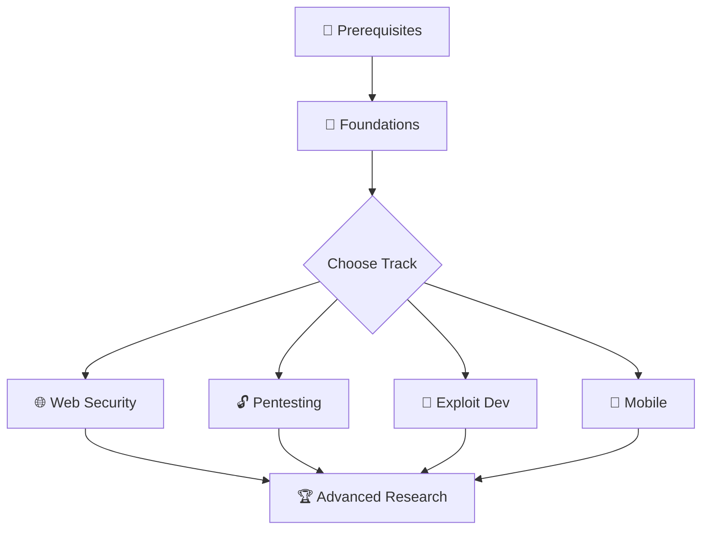

# 🚀 Growth Strategy: awesome-cybersecurity-books

> **Goal:** Increase visibility and achieve trending status on GitHub for  
> [SagarBiswas-MultiHAT/awesome-cybersecurity-books](https://github.com/SagarBiswas-MultiHAT/awesome-cybersecurity-books)

---

## Current State Assessment

| Metric | Current | Target |
|---|---|---|
| Community Health Score | **28%** | 100% |
| LICENSE | ❌ Missing | ✅ Add MIT / CC BY-SA 4.0 |
| CODE_OF_CONDUCT | ❌ Missing | ✅ Add Contributor Covenant |
| CONTRIBUTING.md | ❌ Missing (inline only) | ✅ Standalone file |
| Issue Templates | ❌ Missing | ✅ Add 3 templates |
| PR Templates | ❌ Missing | ✅ Add template |
| Social Preview Image | ❌ Default OG | ✅ Custom branded |
| Repo Topics | ~10 set | Expand to 20 (max) |
| README visual appeal | Text-only, no badges/images | Rich media + shields |
| File structure | Flat (README + Google Drive link) | Organized directories |

### Competitive Landscape

Your **direct competitors** are massive:
- `trimstray/the-book-of-secret-knowledge` — **~234k ⭐**
- `Hack-with-Github/Awesome-Hacking` — **~117k ⭐**
- `The-Art-of-Hacking/h4cker` — **~28k ⭐**

> [!IMPORTANT]
> Your differentiation is the **curated learning path with difficulty ordering** — no other top repo does this. Lean into this hard. Most competitors are flat link dumps. You provide a curriculum.

---

## Actionable Recommendations

### Phase 1: Foundation — Fix Repository Health (Days 1–3)

**1. Add a LICENSE file (CC BY-SA 4.0 recommended)**

This is the single biggest red flag for potential contributors and stargazers. Without a license, people cannot legally redistribute or build upon your work, which suppresses forks and contributions. Creative Commons BY-SA 4.0 is ideal for a curated educational resource (not code, so MIT/Apache don't apply).

```
File: LICENSE
Content: Creative Commons Attribution-ShareAlike 4.0 International
```

**2. Add CODE_OF_CONDUCT.md**

Use the [Contributor Covenant v2.1](https://www.contributor-covenant.org/version/2/1/code_of_conduct/). This signals that your repo is a safe, welcoming community — critical for an educational project that targets beginners.

**3. Create a standalone CONTRIBUTING.md**

Your current README has a 5-line "Contributing" section. Expand it into a proper file with:
- How to suggest a new book (Issue template link)
- How to report a broken link (Issue template link)
- How to propose reorganization (PR template link)
- Style guide for entries (title, author, one-line reason, difficulty tag)
- Commit message conventions

**4. Add Issue & PR Templates**

Create `.github/ISSUE_TEMPLATE/`:
```
suggest-book.yml         → "📚 Suggest a Book"
report-broken-link.yml   → "🔗 Report a Broken Link"
improve-content.yml      → "✏️ Improve Content / Fix Typo"
```
Create `.github/PULL_REQUEST_TEMPLATE.md` with a checklist.

**5. Add a SECURITY.md**

For a cybersecurity repo, this is *especially* expected. Even if just to say "this repo contains no executable code — report content concerns via Issues."

> [!TIP]
> Completing steps 1–5 will raise your Community Health Score from 28% → 100%, which directly impacts how GitHub surfaces your repo in search and recommendations.

---

### Phase 2: README Overhaul — Visual Impact & SEO (Days 3–7)

**6. Add a Hero Banner / Social Preview**

Create a custom Open Graph image (1280×640px) with:
- The repo name in large, bold type
- A visual (shield/lock icon with books)
- Tagline: *"70+ curated cybersecurity books · Beginner → Advanced · Free & Open"*

Set this as the repo's Social Preview via Settings → Social Preview. This is what appears when your link is shared on Twitter/X, LinkedIn, Discord, Reddit.

**7. Add Shields/Badges to the README Header**

Add a badge bar immediately after the title:

```markdown


```

Stars/forks badges create a **social proof feedback loop**: visitors see activity → they star → the number grows → more visitors star.

**8. Add a Visual Learning Path Diagram**

Replace the text-based "Suggested Learning Path" (Section 15) with a **Mermaid flowchart** or an embedded image. GitHub natively renders Mermaid:



This makes the page visually engaging at first glance and increases time-on-page.

**9. Add Book Count & Difficulty Emoji Tags**

Each section heading should include a book count for scannability:
```markdown
## 2. Penetration Testing / Red Team Methodology (5 books)
```

Each book entry should have a difficulty tag:
```markdown
- 🟢 **Web Hacking 101** by Peter Yaworski — gentle intro...
- 🟡 **The Web Application Hacker's Handbook** — deep-dive...
- 🔴 **Advanced Penetration Testing** — red-team tradecraft...
```

**10. Expand the Repository Topics to Maximum (20)**

Current topics cover ~10 slots. Expand to 20 for maximum GitHub Search surface area:

```
cybersecurity, ethical-hacking, penetration-testing, cybersecurity-library,
malware-analysis, exploit-development, cryptography, defensive-security,
free-learning, learning-roadmap, web-security, bug-bounty, reverse-engineering,
infosec, hacking-books, security-books, oscp, ctf, network-security,
cybersecurity-roadmap
```

> [!IMPORTANT]
> Topics are **the primary mechanism** for GitHub's search index and topic-based discovery pages. Maxing these out is free SEO.

---

### Phase 3: Content Differentiation (Days 7–14)

**11. Create Domain-Specific Sub-Pages**

Move from a single monolithic README to a structured directory:

```
README.md                          ← Hero + ToC + quick start
docs/
  web-security.md                  ← Full section with reviews
  penetration-testing.md
  exploit-development.md
  malware-analysis.md
  ...
CONTRIBUTING.md
LICENSE
```

Each sub-page should include:
- Book summary (2–3 sentences, not just the title)
- Prerequisites (which other books to read first)
- Companion lab recommendations (TryHackMe rooms, HTB boxes)
- Links to author talks / conference presentations
- Edition notes (which edition, what changed)

This dramatically increases the **unique content surface area** that Google indexes.

**12. Add a "What Makes This Different" Section**

Add a prominent section near the top of the README that explicitly states your value proposition vs. competitors:

```markdown
## Why This Library?

Unlike flat "awesome lists" that dump hundreds of links, this library:
- 📊 **Orders books by difficulty** within each domain (beginner → advanced)
- 🗺️ **Provides a structured learning path** so you know what to read next
- 🔗 **Cross-references prerequisites** across domains
- 🆓 **Focuses exclusively on accessible resources** — no paywalled content
- 📝 **Includes reading notes** tied to each title
```

**13. Add a "Recently Added" / Changelog Section**

Create a `CHANGELOG.md` or a "What's New" section at the top of the README:

```markdown
### 📢 Recently Added (July 2026)
- 🆕 **AI Red Teaming Fundamentals** by Wunderwuzzi — Added to Section 14
- 🆕 **The Hardware Hacking Handbook** — New Section 15: Hardware Security
- 📝 Updated learning path with 2026 certification alignment
```

This signals **active maintenance** — a critical factor for both GitHub's algorithm and human trust. Repos that look abandoned don't get stars.

**14. Add Companion Resources for Each Book**

For your top 10 most popular books, add a structured "companion" block:

```markdown
- 🟡 **Practical Malware Analysis** by Michael Sikorski & Andrew Honig
  - 🔬 Lab: [PMA Labs GitHub](https://github.com/...)
  - 🎥 Video: [Author talk at REcon](https://youtube.com/...)
  - 📋 Cheatsheet: [RE Cheatsheet](https://...)
  - ⏱️ Estimated study time: 6–8 weeks
```

No other competitor does this. This transforms your repo from a "list" into a **study companion**.

---

### Phase 4: Community & Engagement Engine (Days 14–30)

**15. Enable GitHub Discussions**

Turn on the Discussions tab (Settings → Features → Discussions). Create initial categories:
- 📚 Book Reviews
- 🗺️ Learning Path Help
- 💡 Book Suggestions
- 🏆 Study Progress / Show Your Notes

Discussions create **recurring engagement** — people come back to reply, which generates notifications, which brings more people. This also gives you a forum without leaving GitHub.

**16. Create "Good First Issue" Tasks**

Open 10–15 issues tagged `good first issue` + `help wanted`:
- "Add companion lab links for Section 2 books"
- "Write 2-sentence summary for [Book X]"
- "Verify Google Drive link for [Book Y] still works"
- "Add difficulty emoji tags to Section 6"

These attract first-time contributors during Hacktoberfest (October) and year-round. Each contribution = 1 more person invested in your repo.

**17. Add an "Awesome List" Badge & Submit to Awesome Lists**

Submit your repo to:
- [awesome-cybersecurity](https://github.com/fabionoth/awesome-cybersecurity) — submit a PR
- [awesome-hacking](https://github.com/Hack-with-Github/Awesome-Hacking) — submit a PR
- [awesome-security](https://github.com/sbilly/awesome-security) — submit a PR
- [awesome](https://github.com/sindresorhus/awesome) — the meta-list (harder, but highest impact)

Each inclusion creates a **permanent inbound link** from a high-authority repo.

**18. Create a GitHub Release for "v1.0"**

Tag and publish a GitHub Release with a changelog. Releases:
- Show up in RSS feeds
- Trigger GitHub notification emails for watchers
- Create a "Releases" section on the repo page
- Signal project maturity

---

### Phase 5: External Amplification — Star Velocity Campaign (Days 30–45)

> [!IMPORTANT]
> GitHub trending is driven by **star velocity** — the rate of new stars in a 24-hour window relative to your baseline. You need a coordinated launch to spike this metric from multiple traffic sources simultaneously.

**19. Write & Publish a "How I Built My Cybersecurity Self-Study Curriculum" Blog Post**

Publish on **at least 3 platforms simultaneously**:
- **Dev.to** (tag: #cybersecurity, #beginners, #hacking, #security)
- **Hashnode** (tag: cybersecurity, ethical hacking)
- **Medium** (publications: "InfoSec Write-ups", "Better Programming")

The post should:
- Tell your personal story (why you created this)
- Show the learning path diagram
- Link to the repo prominently
- Include a CTA: "⭐ Star the repo to bookmark it"

**20. Reddit Campaign (Coordinated, Not Spammy)**

Post to these subreddits (one per day over a week, not all at once):

| Day | Subreddit | Angle |
|---|---|---|
| Mon | r/cybersecurity | "I curated 70+ free cybersecurity books into a structured learning path" |
| Tue | r/netsecstudents | "Free self-study curriculum for breaking into infosec" |
| Wed | r/hacking | "Open-source cybersecurity book library — organized by difficulty" |
| Thu | r/learnprogramming | "Free resources for learning security-focused programming" |
| Fri | r/AskNetsec | Value-add comment in a "how to start" thread linking the repo |

> [!WARNING]
> Reddit **hates** self-promotion. Frame every post as value-first with the repo as a natural resource, not the pitch. Engage in comments. Answer follow-up questions for 48 hours.

**21. Twitter/X Thread Launch**

Create a viral-format thread:
```
🧵 I spent [X months] building a free cybersecurity self-study library.

70+ books. Organized by domain. Ordered by difficulty.

From absolute beginner → advanced exploit developer.

Here's the full roadmap 🔽
```

Thread structure (10–12 tweets):
1. Hook + book count
2. Learning path diagram (image)
3. Best beginner books (3 picks)
4. Best web security books
5. Best pentesting books
6. Best exploit dev books
7. What makes this different from "awesome lists"
8. How to contribute
9. CTA: Star + Share
10. Link to repo

**22. LinkedIn Post for Professional Audience**

LinkedIn has massive organic reach for educational content. Frame it as:
- "I built this for the junior analysts on my team..."
- "Every CISO should bookmark this for their team's development..."

**23. Hacker News "Show HN" Post**

Submit as: `Show HN: Free Cybersecurity Self-Study Library – 70+ Books Organized by Difficulty`

Timing: Tuesday–Thursday, 9–11am EST. HN front page = thousands of stars in hours.

**24. Submit to Cybersecurity Newsletters**

Reach out to:
- **tl;dr sec** (newsletter by Clint Gibler)
- **Unsupervised Learning** (Daniel Miessler)
- **This Week in Security** (Zack Whittaker)
- **SANS NewsBites**

A single newsletter mention can drive 500–2,000 stars.

---

### Phase 6: Long-Term Sustainability (Ongoing)

**25. Monthly "Library Update" Commits**

Commit at least once per month with new books, updated links, or community-suggested additions. GitHub's algorithm and Google both penalize stale repos.

**26. Automate Link Checking**

Add a GitHub Action that runs weekly to verify all Google Drive / external links are alive:

```yaml
# .github/workflows/link-check.yml
name: Check Links
on:
  schedule:
    - cron: '0 0 * * 0'  # Weekly on Sunday
  workflow_dispatch:
jobs:
  linkcheck:
    runs-on: ubuntu-latest
    steps:
      - uses: actions/checkout@v4
      - uses: lycheeverse/lychee-action@v2
        with:
          args: --verbose --no-progress '*.md' 'docs/**/*.md'
```

**27. Add a GitHub Sponsors / "Support This Project" Section**

Even if you don't monetize, adding a `FUNDING.yml` enables the "Sponsor" button, which signals project legitimacy.

**28. Cross-Link From Your Personal Site (multihat.dev)**

Since you own `multihat.dev`, add a dedicated page like `multihat.dev/library` that:
- Embeds/mirrors the README content
- Has proper SEO meta tags targeting "free cybersecurity books 2026"
- Links back to the GitHub repo
- Creates a Google-indexable landing page (GitHub READMEs are indexed, but slower)

**29. Track Progress with GitHub Insights**

Monitor weekly:
- Traffic → Referring sites (which campaign is working?)
- Traffic → Popular content (which sections get clicks?)
- Stars graph (velocity spikes correlate with which activity?)

**30. Seasonal Pushes**

Align major updates with high-traffic cybersecurity events:

| Month | Event | Action |
|---|---|---|
| October | Hacktoberfest | Label 20+ issues `hacktoberfest` |
| October | Cybersecurity Awareness Month | Major content push + social campaign |
| January | New Year resolutions | "2027 Cybersecurity Learning Plan" post |
| March | OSCP/CEH exam seasons | Cert-aligned study guides |

---

## Prioritized Execution Order

| Priority | Action | Impact | Effort |
|---|---|---|---|
| 🔴 P0 | Add LICENSE, CODE_OF_CONDUCT, CONTRIBUTING.md | High | Low |
| 🔴 P0 | Expand topics to 20 | High | Trivial |
| 🔴 P0 | Add badges + hero banner to README | High | Low |
| 🟡 P1 | Issue/PR templates, Discussions | High | Low |
| 🟡 P1 | Add difficulty tags + book counts | Medium | Medium |
| 🟡 P1 | Visual learning path (Mermaid diagram) | Medium | Low |
| 🟡 P1 | "What Makes This Different" section | High | Low |
| 🟠 P2 | Sub-pages with companion resources | Very High | High |
| 🟠 P2 | Blog post + Reddit + Twitter launch | Very High | High |
| 🟠 P2 | Submit to awesome lists + newsletters | High | Medium |
| 🟢 P3 | GitHub Actions link checker | Medium | Low |
| 🟢 P3 | Monthly updates cadence | High | Low (ongoing) |
| 🟢 P3 | Hacktoberfest + seasonal pushes | High | Medium (seasonal) |

---

## Confidence & Assumptions

**Confidence Level: 85%**

This strategy is based on:
- ✅ Direct analysis of your repo's current state (28% health score, missing community files)
- ✅ Competitive analysis of the top 5 repos in your niche (234k–10k stars)
- ✅ Research into GitHub's trending algorithm (velocity-based, not cumulative)
- ✅ Real-world patterns from repos that successfully trended

**Key Assumptions:**
1. **The Google Drive links contain legally distributable content.** If any books are pirated/copyrighted, this is a *massive* risk — GitHub can DMCA the entire repo. Consider auditing and replacing copyrighted content with links to official free/open-access versions or publisher pages.
2. **You have time to execute Phase 5 (amplification) within a 1–2 day window.** Trending requires concentrated velocity, not drip-fed engagement.
3. **The repo will be maintained monthly.** A one-time push that goes stale loses all momentum within 60 days.
4. **Your multihat.dev site can serve as an SEO amplifier.** The cross-linking strategy assumes you control that domain.

> [!CAUTION]
> **Copyright Risk:** Many of the books listed (e.g., *Applied Cryptography* by Schneier, *The C Programming Language* by K&R) are commercially published and copyrighted. If your Google Drive hosts PDF copies without publisher permission, your repo is vulnerable to DMCA takedowns — which would **permanently damage** your GitHub account reputation. Audit every file and replace pirated copies with:
> - Links to the publisher's official page
> - Links to legally free alternatives (author-released PDFs, O'Reilly open access)
> - Links to library access (OpenLibrary, Internet Archive's Controlled Digital Lending)
